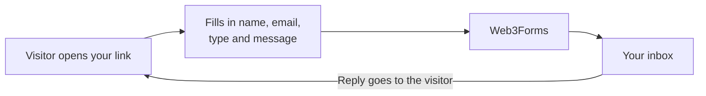

# Advice Tab

  
  

**A shareable link where people can send you reachouts and questions, delivered straight to your email.**

- One static page with no server to run
- Your email address is never shown on the page
- Light and dark mode, and it works on phones
- Spam honeypot built in

Setup, deployment and customization are in **[docs/GUIDE.md](docs/GUIDE.md)**.
