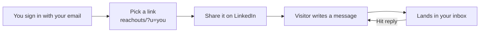

# Reachouts

  
  

**Your own friendly link where people can send you questions. Messages land in your inbox, and you just hit reply.**

- Anyone can sign up: email sign-in link, no password
- Add a short headline and your own intro to your page
- Visitors just type their email and a message
- Your email address is never shown to visitors
- Replies go straight back to the sender
- Rate limits and a spam honeypot built in
- Light and dark mode, and it works on phones

 

Setup, deployment and how it works are in **[docs/GUIDE.md](docs/GUIDE.md)**.
